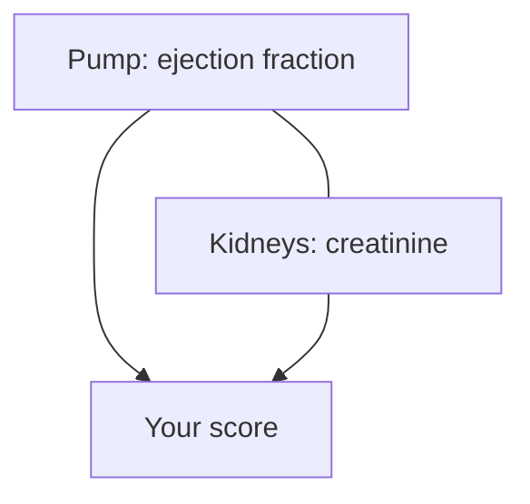

# Case 2 - Which heart-failure patients should the nurse call first?

**Stream:** Biomedical and Health Systems  
**Event:** IEEE YP Industry Hackathon  
**Dates:** October 2–4, 2026 | Collision Space, Hunter Hub, University of Calgary

---

## The problem (in plain words)

After a heart-failure hospital stay, patients go home with pills and a follow-up plan. Some are stable. Others - a weak pump, bad kidney numbers, diabetes on top - are heading back to the emergency room. One nurse cannot call 299 people today.

Calling the oldest patients first feels fair, but age is not the danger. The danger is a weak pump plus failing kidneys. Counting risk factors beats counting birthdays.

**Your challenge:** Make a **top 25** call list. Beat “oldest first.” Then **raise the weak-heart weight** and show how the list moves.

You ranked who looks riskiest on paper. You did **not** diagnose anyone.

---

## Who would use this

A heart-failure clinic nurse or a hospital discharge team. You are selling a call list so limited phone hours reach **the likeliest to crash** first, not only the oldest.

---

## Steps

1. Load the patient file. Drop rows with missing values. Say how many.
2. Score each patient in one sentence (example: 2 points for low ejection fraction, 2 for high creatinine, 1 per extra risk factor).
3. Take the top 25. Count how many later died (`DEATH_EVENT`) vs oldest-first.
4. Raise the weak-heart weight (2 to 3 points) and count overlap.
5. Explain what kind of patient rose or fell.

---

## Picture of the loop

---

## New words

| Word | Meaning |
|---|---|
| Ejection fraction | Share of blood the heart pumps per beat (percent); low means a weak pump |
| Serum creatinine | Kidney number in the blood (mg/dL); high means the kidneys struggle |
| Baseline | The simple plan you must beat (here: oldest first) |

---

## Watch or read (optional)

- [Heart failure - symptoms and causes (Wikipedia overview)](https://en.wikipedia.org/wiki/Heart_failure)
- [UCI Heart Failure Clinical Records - where this data comes from](https://archive.ics.uci.edu/dataset/519/heart+failure+clinical+records)
- [Heart diseases and conditions in Canada (Public Health Agency of Canada)](https://www.canada.ca/en/public-health/services/diseases/heart-health/heart-diseases-conditions.html)

---

## Start here

1. Open a terminal **in this folder**.
2. `pip install -r requirements.txt`
3. `python agent_starter.py`
4. Change `HI` from 2 to 3 and run it again.

Data notes: [`data/README.md`](data/README.md). **Python 3.10+** (3.11 is best).
