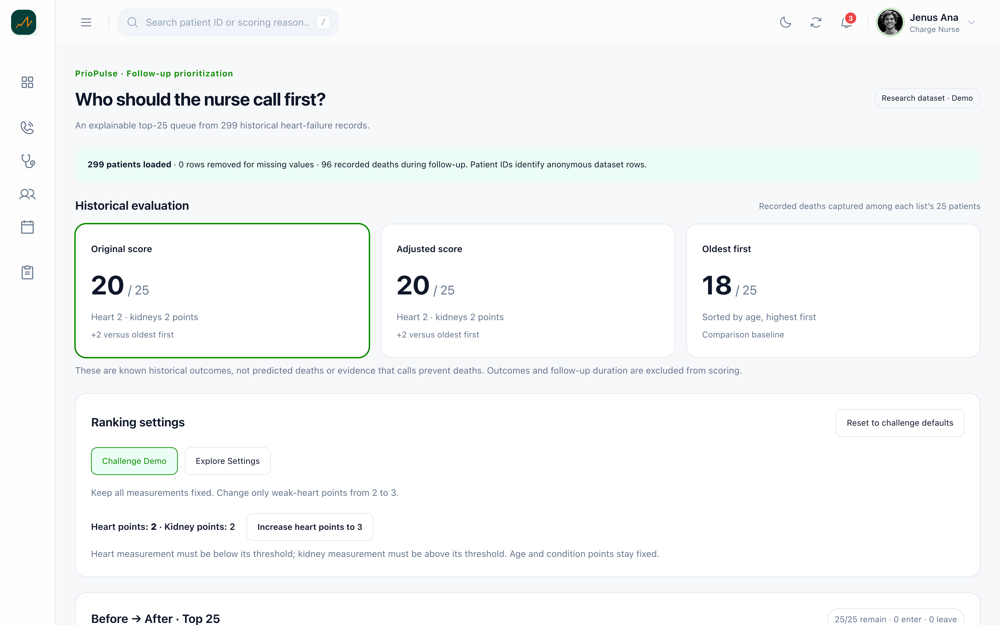
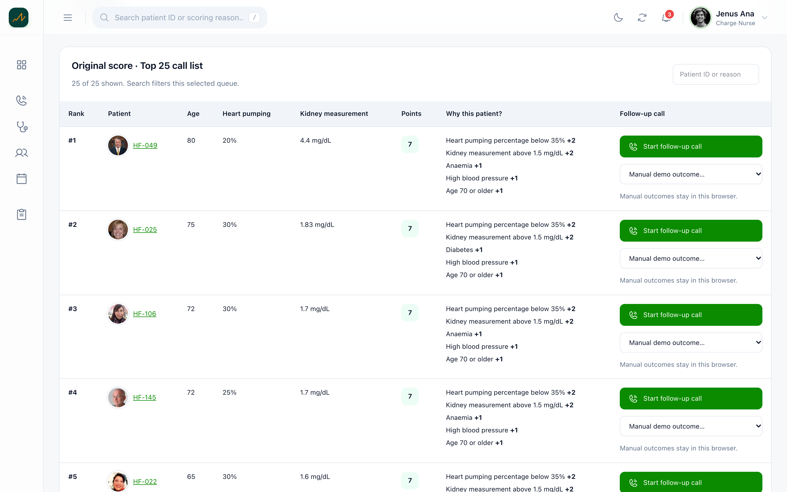
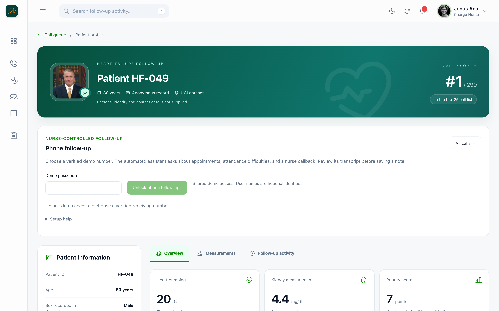
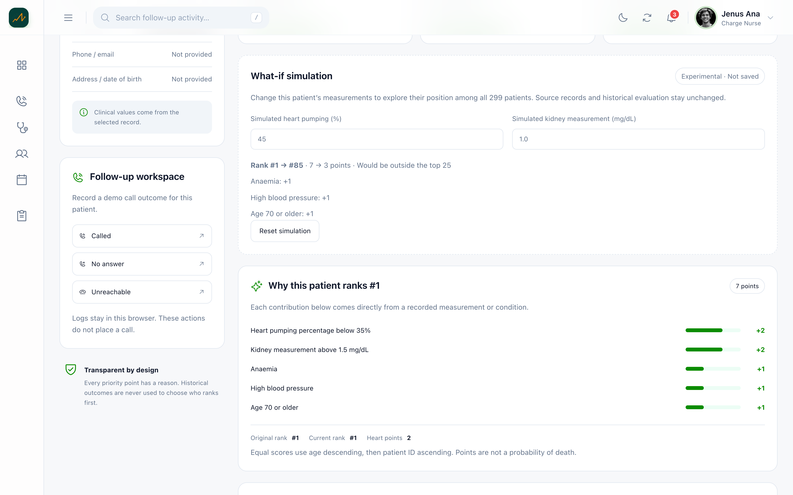
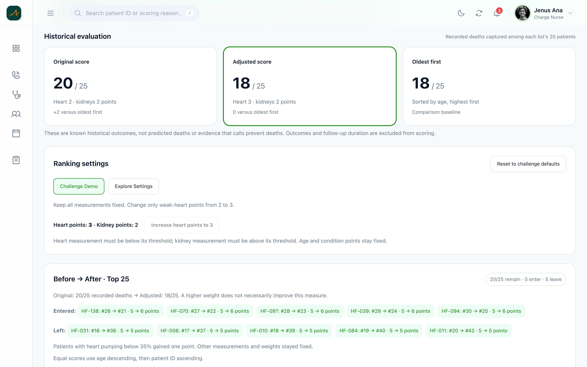
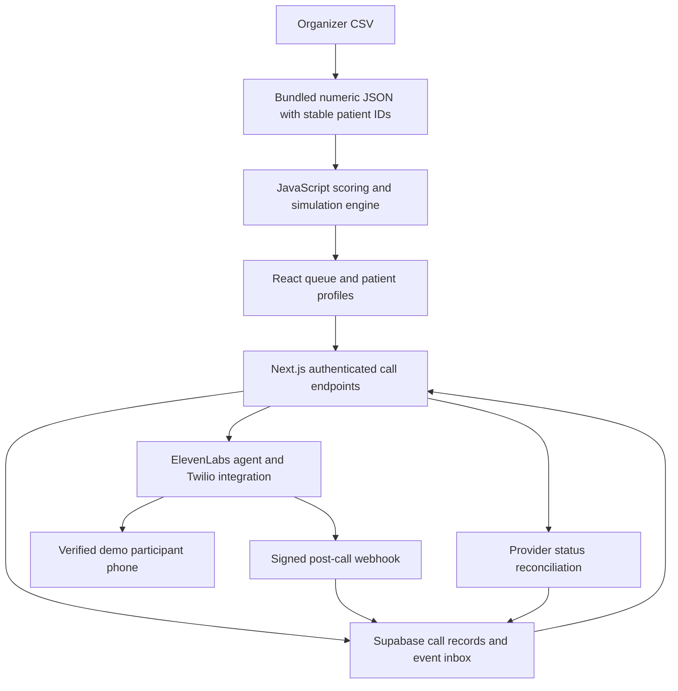

# PrioPulse

**PrioPulse helps nurses decide which heart-failure patients to call first, understand each priority, and manage demonstration phone follow-ups.**

[Live demo](https://priopulse.vercel.app/) · [Source code](https://github.com/krutarthsathe/priopulse) · [Hackathon challenge](./Case%202%20-%20Autonomous%20Heart-Failure%20Follow-Up%20Ranking%20Agent/README.md)

## The problem

A nurse cannot call all 299 patients today. Calling the oldest patients first is simple, but ignores other recorded measurements. The challenge is to create an explainable top-25 call list, compare it with oldest-first, and show what happens when weak-heart measurements receive more points.

Heart failure means the heart does not pump blood as well as it should. This project demonstrates follow-up prioritization using historical anonymous records; its scores are hackathon rules, not validated clinical advice.

## Product screenshots

These are authentic captures of the local application in light mode. Each uses a 1440 × 900 desktop layout, rendered directly at 3× resolution into a 4320 × 2700 lossless PNG. Photos are illustrative interface assets, not photographs of the dataset patients.

### Ranking overview



### Priority call list



### Patient profile and phone follow-up



### Measurement simulation



### Before-and-after comparison



## How it works

PrioPulse converts the supplied records into a ranked list with a reason for every point. Nurses can inspect a record, compare ranking approaches, experiment with settings, and initiate a confirmed call to a verified demo participant. After a conversation, they review the transcript and explicitly save a note.

```mermaid
flowchart LR
    A["299 supplied patient records"] --> B["Score and explain priorities"]
    B --> C["Review the top-25 call list"]
    C --> D["Inspect patient and compare settings"]
    D --> E["Select a verified demo number"]
    E --> F["Nurse confirms phone call"]
    F --> G["Assistant conducts fictional follow-up"]
    G --> H["Nurse reviews transcript and saves note"]
```



Phone calls are optional. Ranking, comparison, simulations, and manual follow-up notes work without an external database or AI service.

## Key features

- **Explainable queue:** Each patient has a score, measurements, and plain-language reasons. Equal scores use older age first, then patient ID, making results repeatable.
- **Historical comparison:** Compare original scoring, adjusted scoring, and oldest-first using the same top-25 capacity.
- **Challenge demonstration:** Change weak-heart points from 2 to 3 while keeping kidney points and all source measurements fixed. See overlap, arrivals, departures, and rank changes.
- **Custom experiments:** Adjust heart and kidney weights and thresholds, plus call capacity of 10, 15, 25, or 50. Historical comparisons always remain top 25.
- **Patient what-if simulation:** Temporarily change heart and kidney measurements to see an individual patient's simulated rank among all 299 records. Source data and queue results remain unchanged.
- **Nurse-controlled calls:** Start from the queue or patient profile, select a configured demo recipient, and confirm before dialing. Calls & Review shows attempts, statuses, transcripts, and notes awaiting review.
- **Explicit note review:** Edit a transcript-based draft and confirm review before saving. No inferred clinical conclusions or automatically saved notes.

## What is different

The project connects an explainable priority list to a concrete follow-up workflow. Users can inspect why someone ranks highly, test whether a scoring change alters the list, and review what happened after a demonstration call.

The ranking engine and conversational AI have separate responsibilities. JavaScript rules calculate priorities; the voice assistant asks a limited set of follow-up questions. The assistant receives no clinical measurements, priority scores, historical outcomes, or dataset patient IDs. The nurse decides when to call and when to save a note.

## Reproducible demonstration

1. Open the home page or **Patients**. Confirm **299 loaded** and **0 missing rows removed**.
2. Compare the historical results below. These count known deaths in the selected records, not predictions or evidence that calls prevent deaths.
3. Click **Increase heart points to 3**. Five patients enter and five leave; 20 remain.
4. Open **HF-049** with default settings. Its original rank is **1**, with **7 points**.
5. In its what-if simulation, set heart pumping to **45%** and kidney measurement to **1.0 mg/dL**. Its simulated rank becomes **85**, with **3 points**. Reset to restore the original view.
6. If phone services are configured, unlock demo access and confirm one call to a consenting verified participant. Review its transcript in **Calls & Review**; a note is saved only after explicit review.

| Ranking approach | Recorded deaths among top 25 |
| --- | ---: |
| Oldest first | 18 |
| Original score: heart 2, kidneys 2 | 20 |
| Revised score: heart 3, kidneys 2 | 18 |

Increasing a weight did not improve this historical measure. That is a useful result to inspect, rather than a reason to hide the comparison.

## Architecture and design

The Next.js application contains both the React interface and server-side API routes. The ranking dataset is bundled JSON; Supabase stores phone-call attempts and reviewed notes, not the full patient dataset.



### Component responsibilities

| Component | Responsibility | Evidence |
| --- | --- | --- |
| Ranking engine | Points, stable ordering, comparisons, isolated simulations | [heart-failure-ranking.js](lib/heart-failure-ranking.js) |
| Queue and profiles | Settings, reasons, patient context, what-if controls | [PatientsPage.jsx](components/PatientsPage.jsx), [HeartFailureDetails.jsx](components/patient-details/HeartFailureDetails.jsx) |
| Phone interface | Access, confirmation, status refresh, transcript review | [calls components](components/calls/) |
| Call service | Validate requests, reserve attempts, initiate and reconcile calls | [call-service.js](lib/call-service.js) |
| Access and webhook authentication | Passcode checks, HttpOnly cookie, signature verification | [call-auth.js](lib/call-auth.js) |
| Server database adapter | Supabase REST and database-function access | [call-store.js](lib/call-store.js) |
| Database schema | One-call reservation, event handling, note review, role restrictions | [schema.sql](supabase/schema.sql) |

### API boundaries

| Endpoint | Purpose |
| --- | --- |
| `POST /api/calls/access` | Unlock shared demo access with a passcode |
| `DELETE /api/calls/access` | Lock browser access |
| `GET /api/calls` | Read authenticated history and reconcile unfinished attempts |
| `POST /api/calls` | Validate patient, allowlisted destination, and confirmation before initiating |
| `POST /api/calls/[id]/review` | Save one explicitly reviewed note |
| `POST /api/elevenlabs/webhook` | Verify and store signed transcript or initiation-failure events |

### Reliability and storage choices

A database reservation permits only one active demo call at a time. Unique request IDs prevent duplicate initiation. An interrupted provider response produces an uncertain status and holds the reservation until reconciled; it does not trigger automatic redial.

A durable event inbox handles repeated notifications and events arriving before provider identifiers have been attached to the attempt. Signed webhooks can update call records without a browser open. Authorized history requests also reconcile provider status.

Calls continue after navigating away. Draft edits survive reloads in the current tab's session storage; reviewed notes are saved once in Supabase. Manual outcomes, manual notes, and ranking-change audit events remain browser-local. The audit log includes fictional sample events.

## Dataset and AI boundaries

The input is the CSV supplied in the [Case 2 data folder](./Case%202%20-%20Autonomous%20Heart-Failure%20Follow-Up%20Ranking%20Agent/data/), originating from the [UCI Heart Failure Clinical Records dataset](https://doi.org/10.24432/C5Z89R). Attribution: Chicco & Jurman, 2020; license: [CC BY 4.0](https://creativecommons.org/licenses/by/4.0/).

The [bundled JSON](data/heart-failure-patients.json) preserves numeric measurements and original row order through generated patient IDs. There are 299 records and no missing rows to remove. Personal names and contact information are not supplied.

### Default scoring rules

| Recorded condition | Points |
| --- | ---: |
| Heart pumping percentage below 35% | 2 |
| Kidney blood measurement above 1.5 mg/dL | 2 |
| Anaemia | 1 |
| Diabetes | 1 |
| High blood pressure | 1 |
| Age 70 or older | 1 |

Heart pumping percentage is called **ejection fraction**. The kidney-related blood measurement is **serum creatinine**. Anaemia means too few healthy red blood cells. These thresholds are challenge rules.

`DEATH_EVENT` and follow-up duration are excluded from ranking. Historical outcomes are used only after lists are selected. No machine-learning model was trained to rank patients.

The managed [ElevenLabs agent](https://elevenlabs.io/docs/eleven-agents/overview) handles speech and conversation through its [Twilio outbound-call integration](https://elevenlabs.io/docs/eleven-agents/api-reference/integrations/twilio/outbound-call). At the last configuration inspection, its conversation model was [Qwen3.5-397B-A17B](https://huggingface.co/Qwen/Qwen3.5-397B-A17B); this is an external agent setting, not pinned in the repository. We did not train or fine-tune it.

The assistant identifies itself as an automated demonstration, asks about appointments, attendance barriers, and callback requests, and must not diagnose, recommend treatment, or claim a nurse has been notified. Configure its maximum conversation duration to 300 seconds. No separate summarization model is used; review drafts contain speaker-labelled transcript text.

## Run locally

Use Node.js 22 LTS and npm. From a fresh checkout:

```bash
git clone https://github.com/krutarthsathe/priopulse.git
cd priopulse
npm ci
npm run dev
```

Open the URL printed by Next.js, normally [localhost:3000](http://localhost:3000). If the port is occupied, Next.js may select another. To choose a port explicitly:

```bash
npm run dev -- --port 3001
```

No phone credentials are needed to explore ranking and simulations. Keep the terminal open; press Control+C to stop the server. If dependencies are missing, run `npm ci`. If Node or npm cannot be found, install Node.js and reopen the terminal.

For production mode:

```bash
npm run build
npm start
```

Rebuild after changing code to update production output.

## Configure phone calls and Vercel

Follow the [phone follow-up setup guide](docs/phone-follow-ups.md) for the [Supabase schema](supabase/schema.sql), agent setup, verified receiving numbers, and signed webhook configuration.

Copy [.env.example](.env.example) to `.env.local`, then provide your own private values. Required server variables:

- `SUPABASE_URL`
- `SUPABASE_SECRET_KEY`
- `ELEVENLABS_API_KEY`
- `ELEVENLABS_AGENT_ID`
- `ELEVENLABS_PHONE_NUMBER_ID`
- `ELEVENLABS_WEBHOOK_SECRET`
- `VOICE_DEMO_PASSCODE`
- `CALL_DEMO_DESTINATIONS`

`ELEVENLABS_BRANCH_ID` is optional; otherwise the server resolves the agent's Main branch. Twilio credentials stay in ElevenLabs. Receiving numbers must be configured in the server allowlist and verified when using Twilio trial accounts.

Add the same variables to the relevant Vercel environment and redeploy. Never use `NEXT_PUBLIC_` for these values or commit `.env.local`. The webhook targets `/api/elevenlabs/webhook` on the deployed HTTPS domain; enable delivery after deploying and validating configuration.

The live homepage returned HTTP 200 and the protected calls endpoint returned HTTP 401 during documentation verification on October 4, 2026. These checks confirm route availability, not completed production phone or webhook testing. The setup guide's workspace-specific paused-webhook note records the earlier preparation state; confirm the current provider setting before a hosted demonstration.

## Verification

```bash
npm test
npm run build
```

The test suites verify:

- Scoring boundaries, stable ties, outcome exclusion, historical comparisons, configurable thresholds, and isolated simulations.
- Passcode access, configuration errors, unknown patients, disallowed numbers, provider failures, and uncertain responses.
- Actual SQL reservations in embedded PostgreSQL through PGlite, concurrent initiation, duplicate requests, and database role restrictions.
- Webhook signatures, repeated events, early-arriving events, transcript association, reconciliation, and explicit note review.

Both commands passed during the README update. Automated tests do not place real phone calls. Browser verification covered call confirmation, navigation, transcript review, draft retention, and duplicate-save prevention using simulated provider responses. One consenting live demo call was previously initiated from the local app and its transcript stored under the correct patient; no note was automatically saved.

The five screenshots were recaptured from the running app and visually inspected. This set demonstrates ranking, queue actions, profile context, measurement simulation, and scoring sensitivity. It does not depict a completed production call.

## Limitations and next steps

This is a hackathon prototype, not a clinical decision system. Historical records do not include current symptoms, appointment schedules, or real contact details. Shared passcode protection and fictional staff identities are demo access, not verified nurse authentication.

There is no bulk calling, automatic retry, appointment booking, call transfer, or automatic clinical escalation. Conversations are processed by ElevenLabs and may be retained according to its account settings. If an uncertain attempt cannot be reconciled, an administrator must inspect provider logs before releasing its reservation.

Next steps are to verify the deployed call and webhook flow, add real staff authentication and access roles, and evaluate prioritization with clinicians and suitable prospective data before considering a real patient workflow.

### Direct demo call access

No passcode is required to initiate calls. The browser automatically initializes a demo session. Calls still require selecting a server-allowlisted receiving number and confirming participant consent. One active call is permitted, and automatic retries remain disabled. Anyone visiting the demo can access these actions and call details; this is not staff authentication. `VOICE_DEMO_PASSCODE` is no longer required.

## All Patients directory

Open **All Patients** in the sidebar or `/all-patients` to browse all 299 records in patient cards. Search by ID, age, or scoring reason; sort by ID, priority, or age; filter to the default top 25; and use pagination to browse the complete dataset. Every card opens its matching patient details. **Priority Call List** remains the ranking workspace, while **Doctors** links directly to the doctor directory.
